# Wireframe — Brick Breaker

Wireframe em alta definição de todas as telas do aplicativo **Brick Breaker (Breakout)**, incluindo os cinco níveis de jogo. Os diagramas seguem o padrão de wireframing (estrutura e navegação em escala de cinza, com anotações numeradas explicadas na legenda de cada figura), e não telas finalizadas.

## 1. Fluxo de navegação

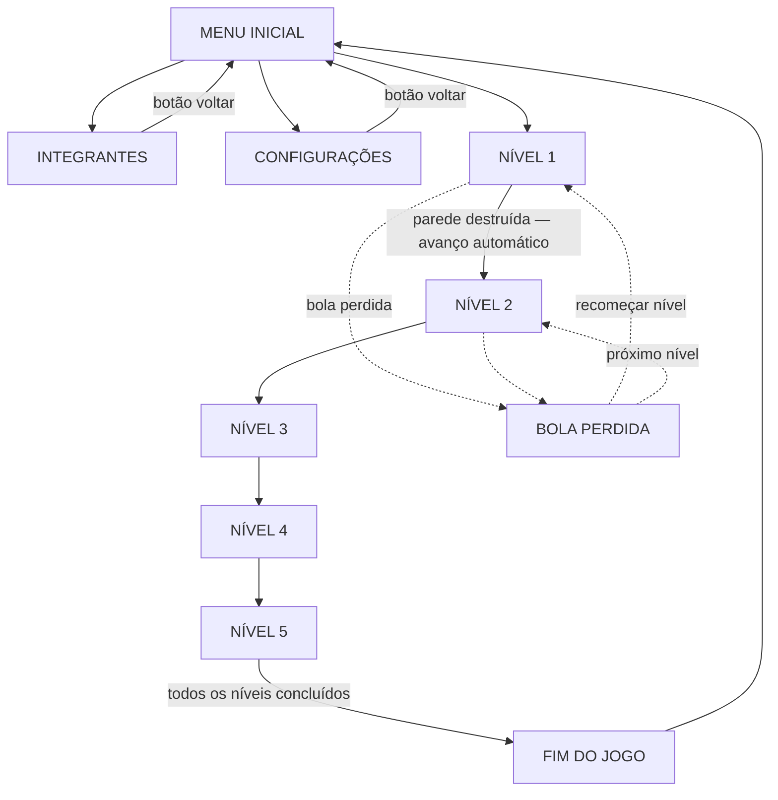

O diagrama completo, com as transições entre telas, está em [`wireframes/png/fluxo-navegacao.png`](wireframes/png/fluxo-navegacao.png).

## 2. Telas do aplicativo

### 2.1 Menu Inicial

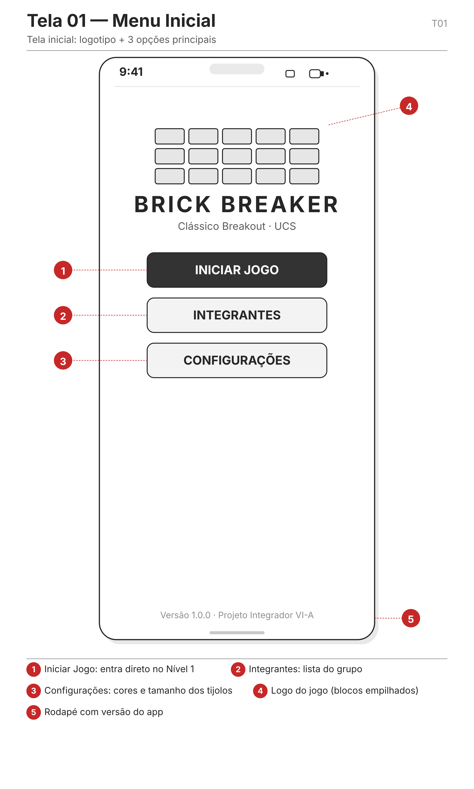

Tela de abertura do aplicativo. Apresenta o logotipo do jogo e três opções: **Iniciar Jogo** (entra diretamente no Nível 1), **Integrantes** (lista o nome e o sobrenome dos membros do grupo) e **Configurações** (padrão de cores e tamanho dos tijolos). O rodapé exibe a versão do aplicativo.

### 2.2 Integrantes

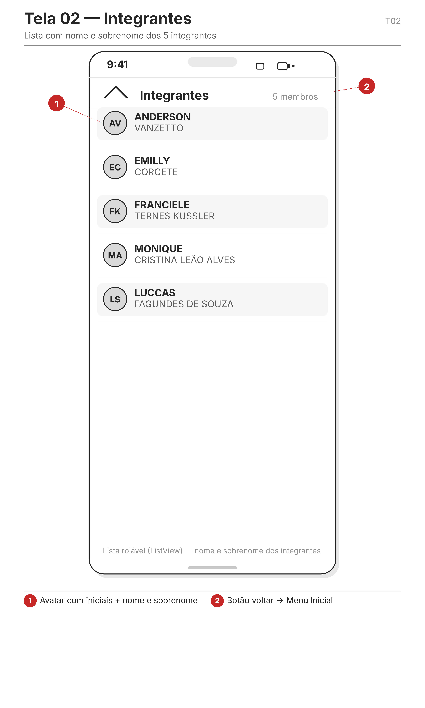

Lista rolável com os cinco integrantes do grupo. Cada item apresenta o avatar com as iniciais, o nome e o sobrenome. A barra superior permite retornar ao Menu Inicial.

### 2.3 Configurações

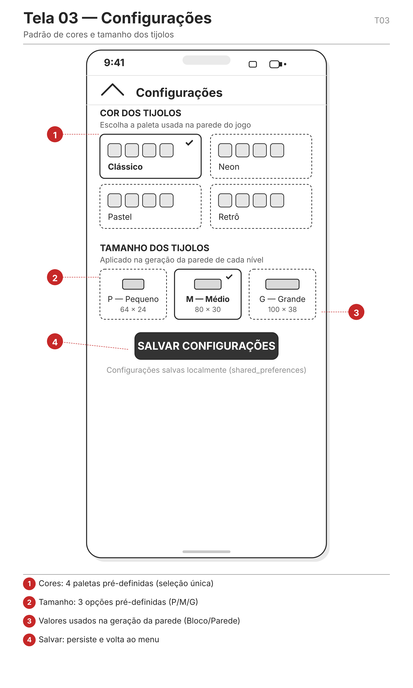

Permite escolher o padrão de cores dos tijolos (quatro paletas pré-definidas) e o tamanho dos tijolos (P — 64×24, M — 80×30 e G — 100×38). Os valores são usados na geração da parede de cada nível e persistidos localmente ao salvar.

### 2.4 Jogo — Níveis 1 a 5

As telas de jogo compartilham o mesmo cabeçalho (nível atual, pontuação, pausa e som) e o mesmo modelo de interação: a bola é rebatida pela plataforma (paddle), que acompanha o toque no eixo horizontal; os blocos atingidos são destruídos e a área de jogo ocupa a maior parte da tela. Ao destruir toda a parede, o próximo nível inicia automaticamente.

#### Nível 1 — Parede sólida

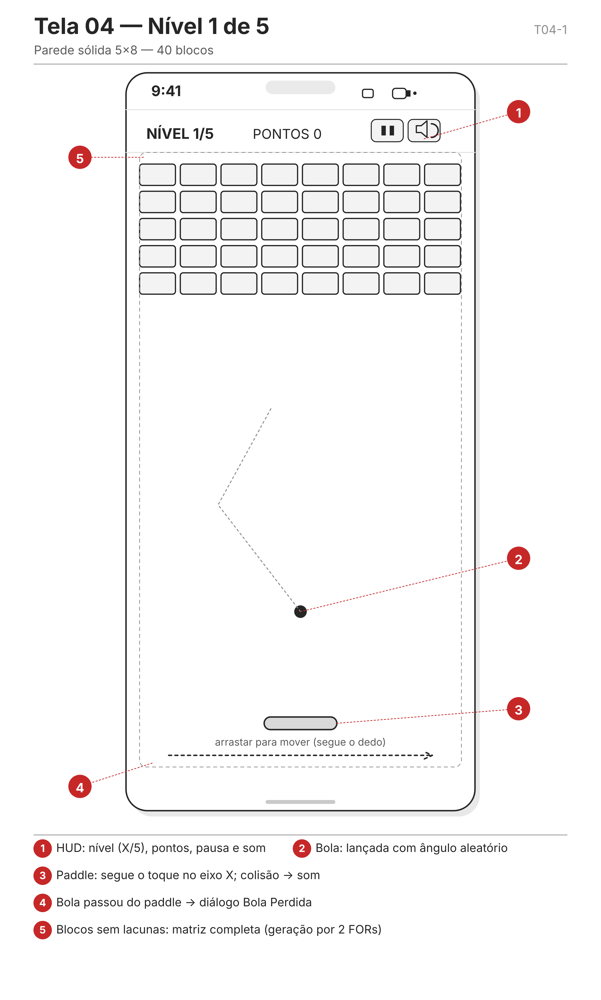

Parede completa de 5 linhas × 8 colunas (40 blocos), sem lacunas.

#### Nível 2 — Parede com aleatoriedade

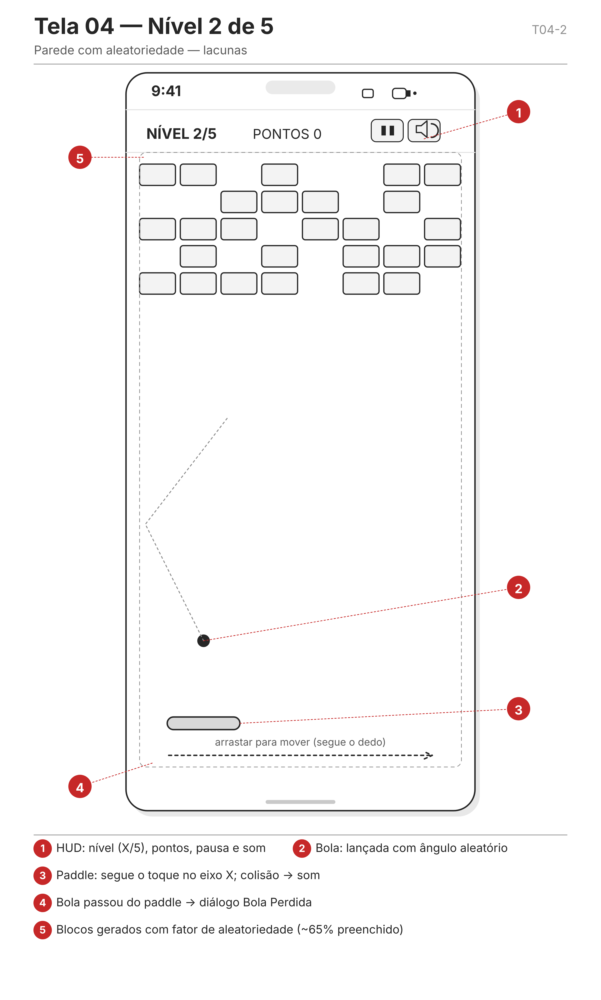

Parede gerada com fator de aleatoriedade (cerca de 65% dos blocos preenchidos), criando lacunas.

#### Nível 3 — Parede em pirâmide

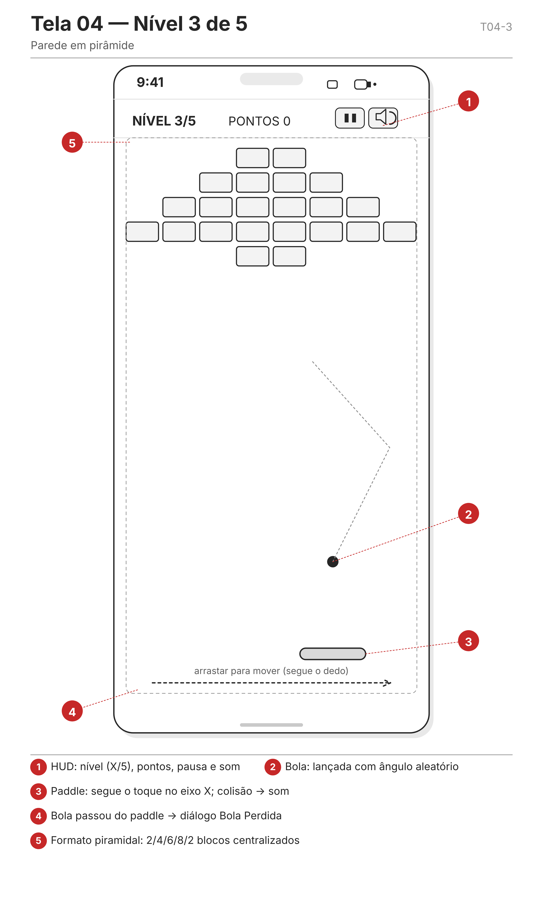

Parede em formato piramidal, com 2, 4, 6, 8 e 2 blocos por linha, centralizados.

#### Nível 4 — Parede em escada

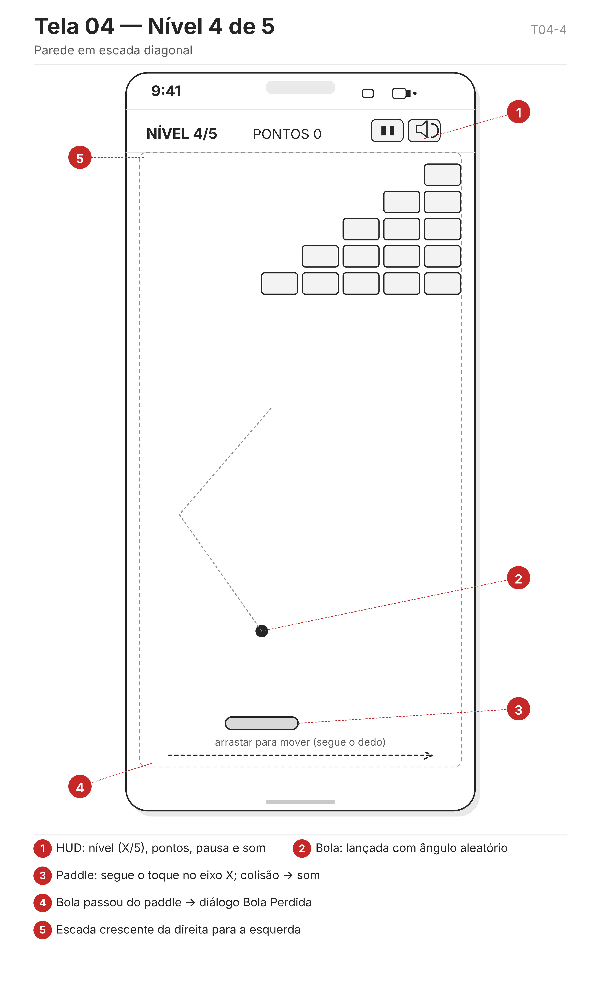

Parede em formato de escada diagonal, com 1 a 5 blocos por linha, da direita para a esquerda.

#### Nível 5 — Parede em diamante com blocos resistentes

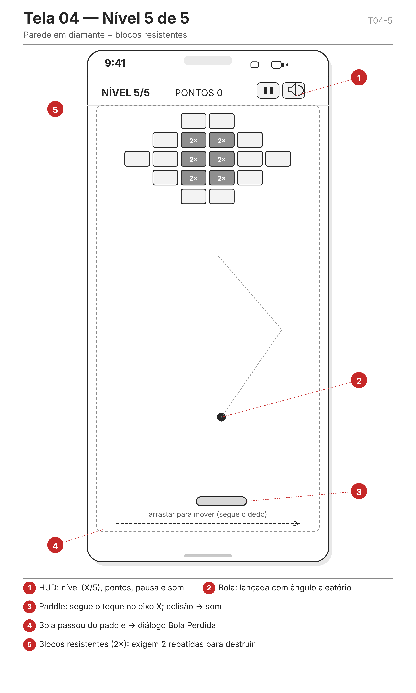

Parede em formato de diamante (2, 4, 6, 4 e 2 blocos por linha). Os blocos centrais (em cinza escuro, marcados com "2×") são resistentes e exigem duas rebatidas para serem destruídos.

### 2.5 Bola Perdida

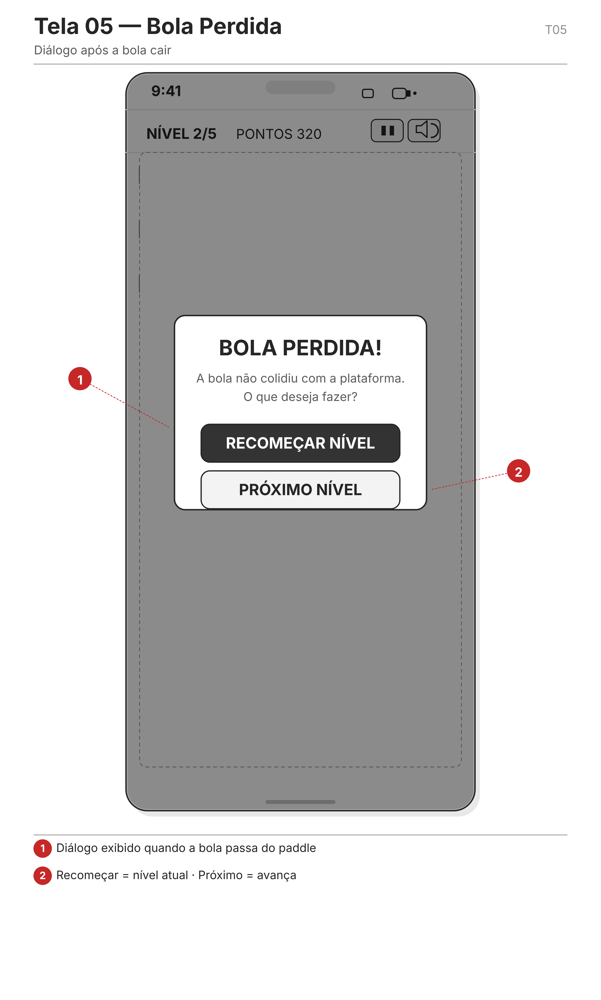

Diálogo exibido quando a bola não colide com a plataforma. O jogador escolhe entre **Recomeçar Nível** (reinicia o nível atual) e **Próximo Nível** (avança para o nível seguinte).

### 2.6 Nível Concluído

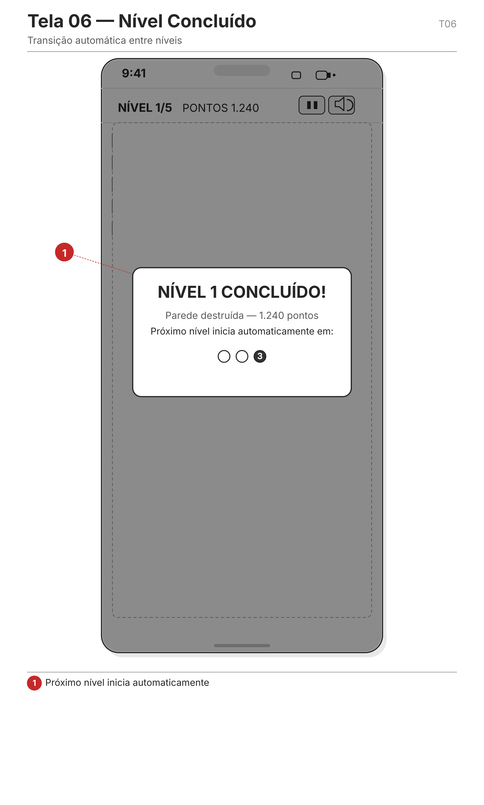

Tela de transição exibida ao destruir a parede de um nível. Apresenta a pontuação acumulada e a contagem regressiva para o início automático do próximo nível.

## 3. Resumo das paredes dos níveis

| Nível | Padrão | Blocos | Característica |
|---|---|---|---|
| 1 | Sólida | 40/40 | Matriz completa 5×8, sem lacunas |
| 2 | Aleatória | ~26/40 | Lacunas geradas com fator de aleatoriedade |
| 3 | Pirâmide | 22/40 | Linhas de 2, 4, 6, 8 e 2 blocos centralizadas |
| 4 | Escada | 15/40 | Linhas de 1 a 5 blocos, da direita para a esquerda |
| 5 | Diamante | 16/40 | Linhas de 2, 4, 6, 4 e 2 blocos + 6 resistentes (2×) |

## 4. Arquivos

| Arquivo | Tipo | Descrição |
|---|---|---|
| `wireframes/svg/` | SVG | Fontes vetoriais editáveis de todas as telas |
| `wireframes/png/` | PNG | Versões renderizadas em alta definição para visualização |
